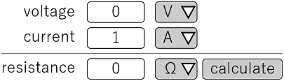

# ECal Script
Markdown-like easy online calculator description language   
(ECal stands for Easy Calculator)   
Parser is in JavaScript library form

## example
- script
  ```
  t V; n V; s V
  t I; n I; s I
  ---
  t R; n R; s R; b calc

  # t V = voltage; t I = current; t R = resistance
  # n V = 0; n I = 1; n R = 0
  # s V = [V]; s I = [A]; s R = [Ω]; b calc = calculate
  @ b calc -> n R = n V / n I
  ```
- display result
  - 

## purpose
- easy creation of web-based calculator
- used for quick, casual calculations like
  - unit conversion. ex.) Oersted->A/M
  - arithmetic operations with several inputs and single output ex.) calculate resistance from voltage and current

## usage
- import JavaScript library `ecalscript.js`
  ```html
  <script src="path/of/index.js"></script>
  ```
- write ecalscript as a string
  ```javascript
  contents = `
    t V; n V; s V
    t I; n I; s I
    ---
    t R; n R; s R; b calc

    # t V = voltage; t I = current; t R = resistance
    # n V = 0; n I = 1; n R = 0
    # s V = [V]; s I = [A]; s R = [Ω]; b calc = calculate
    @ b calc -> n R = n V / n I
  `
  ```
- parse and render using `ecalscript.parse()`
  ```javascript
  ecalscript.parse(contents);
  ```

## syntax
- html part
  - `[t,n,s,b]_`(t,n,s,b followed by one space) denotes variable type
    - t: text
    - n: number
    - s: select
    - b: button
  - `;`(semicolon) denotes new column
  - `---` denotes section line
- script part
  - `#` denotes initial condition
  - `@ b button_name` denotes event at button press
  - `;`(semicolon) splits each expressions
